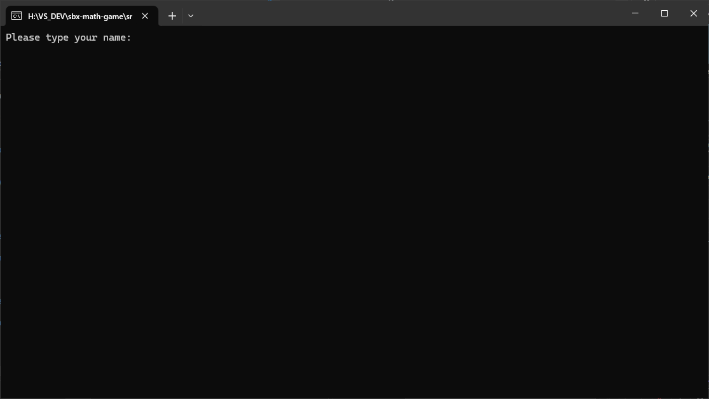
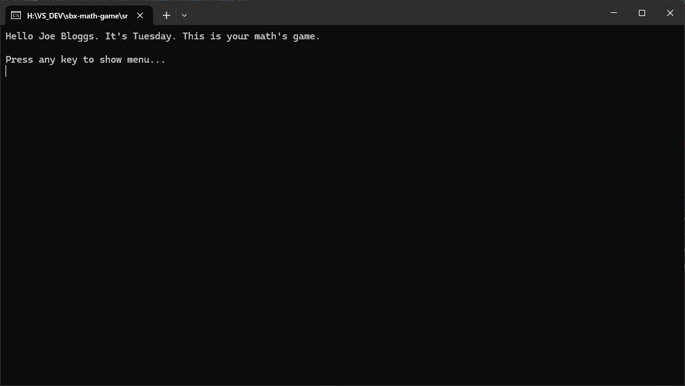
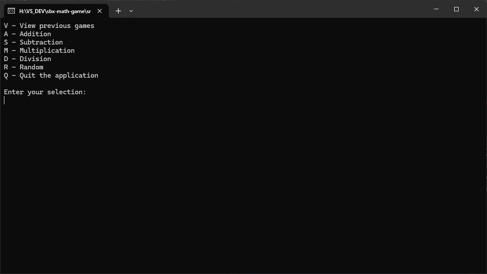
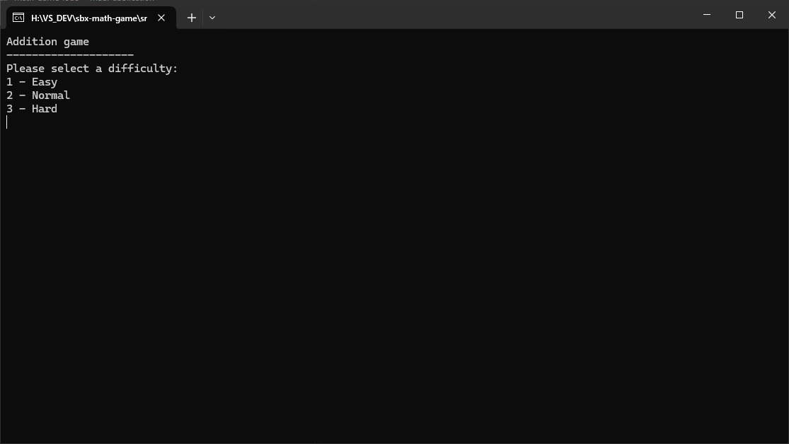
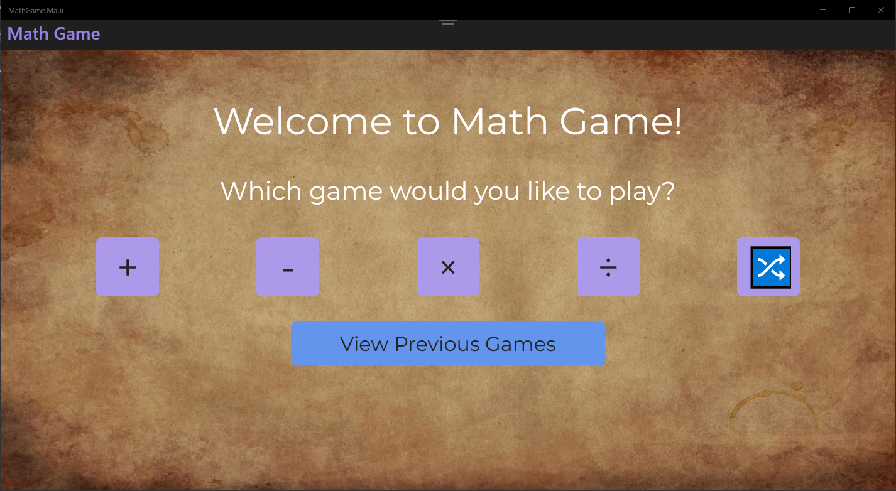
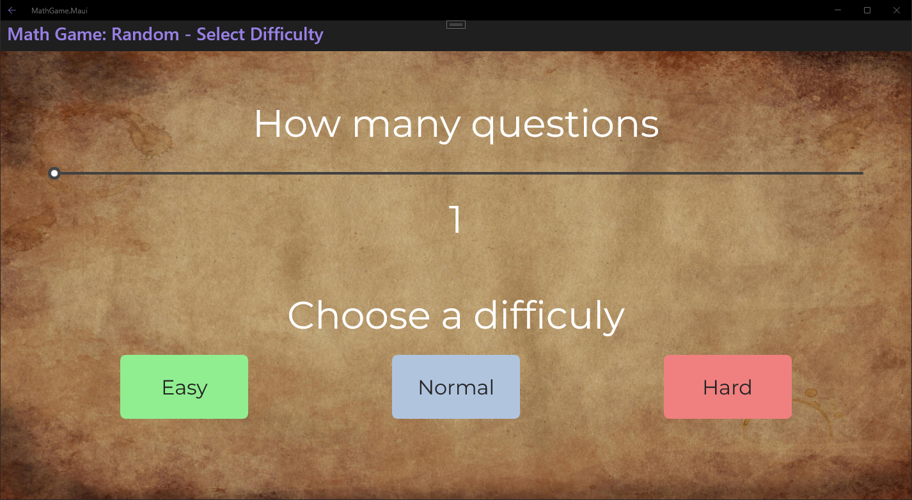



<h1> Math Game</h1>

Welcome to the Math Game App!

This interactive application was built as a demo application, with the target audience being young school children.
It aims to challenge their math skills through various arithmetic operations. 
It can be played via Console Application, or MAUI application (Windows only).

Choose your operation, difficulty level, and number of questions to start sharpening your mind!

## Features

- **Basic Operations**: Addition, Subtraction, Multiplication, Division.
- **Integer-Only Division**: All division problems ensure integer results with dividends ranging from 0 to 100.
- **User Menu**: Easy-to-use menu for selecting operations, difficulty levels, and more.
- **Game History**: View a history of all your previous games.
- **Difficulty Levels**: Select from different levels of difficulty to match your skill.
- **Timer**: Tracks the time taken to complete each game.
- **Customizable Questions**: Choose the number of questions you want to attempt.
- **Random Game**: Get questions from random operations for an extra challenge.

## Getting Started

### Prerequisites

- .NET 8 SDK installed on your system.

### Installation

#### Console

1. Clone the repository:
	- `git clone https://github.com/cjc-sweatbox/math-game.git`

2. Navigate to the project directory:
	- `cd src\math-game\MathGame.Console`

3. Run the application using the .NET CLI:
	- `dotnet run`

#### MAUI

To be confirmed.

## Usage

### Console

When you start the application, you will be asked to type your name:

After which, the application will welcome you:

You will then be presented with a menu:

Choose an option:
- **V**: to view the games history page, including date, game type, score and time taken.
- **A**: to play an Addition game.
- **S**: to play a Subtraction game.
- **M**: to play a Multiplication game.
- **D**: to play a Division game.
- **R**: to play a game with a mix of questions from all operations.
- **Q**: to quit the application.

If you choose to play a game, you will then be presented with a difficulty menu:
    

Choose an option:
- **Easy**: numbers between 1-10.
- **Medium**: number between 1-100.
- **Hard**: number between 1-1000

Then, enter how many questions you want to answer and the game will then start with your your selected options.

On completion, the game will be recorded to an SQLite3 database.

### MAUI

When you start the application, you will be presented with a menu:

Choose an option:
- **+**: to play an Addition game.
- **-**: to play a Subtraction game.
- **×**: to play a Multiplication game.
- **÷**: to play a Division game.
- **🔀**: to play a game with a mix of questions from all operations.
- **View Previous Games**: to view the games history page, including date, game type, score and time taken.

If you choose to play a game, you will then be presented with a difficulty menu:
    

Use the slider to choose how many questions you want to answer.

Then choose a difficulty and the game will then start with your your selected options:
- **Easy**: numbers between 1-10.
- **Medium**: number between 1-100.
- **Hard**: number between 1-1000

On completion, the game will be recorded to an SQLite3 database.

## How It Works

- **Menu Navigation**: Navigate through the menu using the provided options to set up your game.
- **Question** Generation: Based on your selected operation and difficulty, the app generates questions.
- **Timer**: The timer starts when you begin answering and stops when you finish.
- **History Recording**: After completing a game, your score and time are recorded in the history.    

## Contributing

Contributions are welcome! Please fork the repository and create a pull request with your changes. For major changes, please open an issue first to discuss what you would like to change.

## License

This project is licensed under the MIT License. See the [LICENSE](./LICENSE) file for details.

## Contact

For any questions or feedback, please open an issue.

---
***Happy Math Gaming!***
