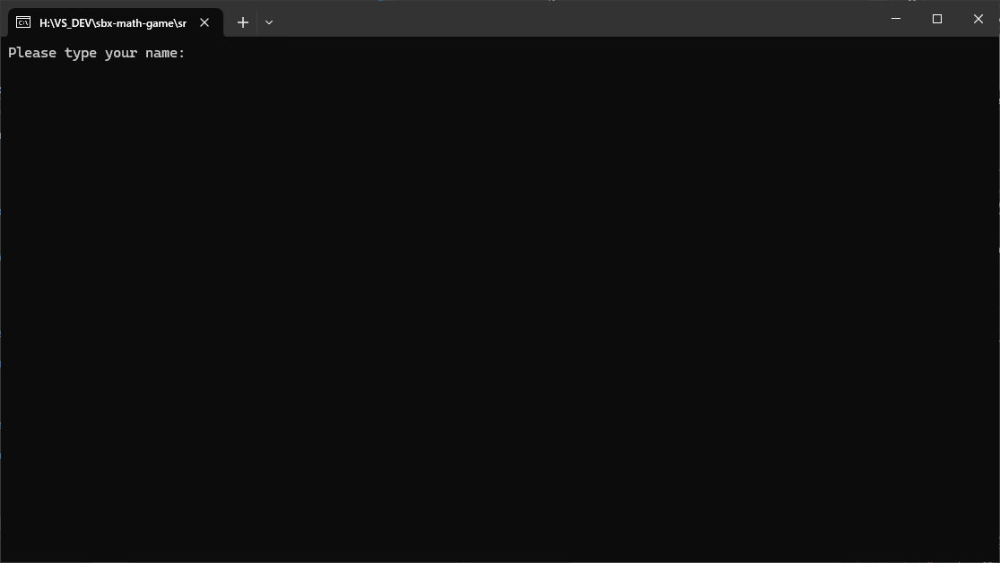
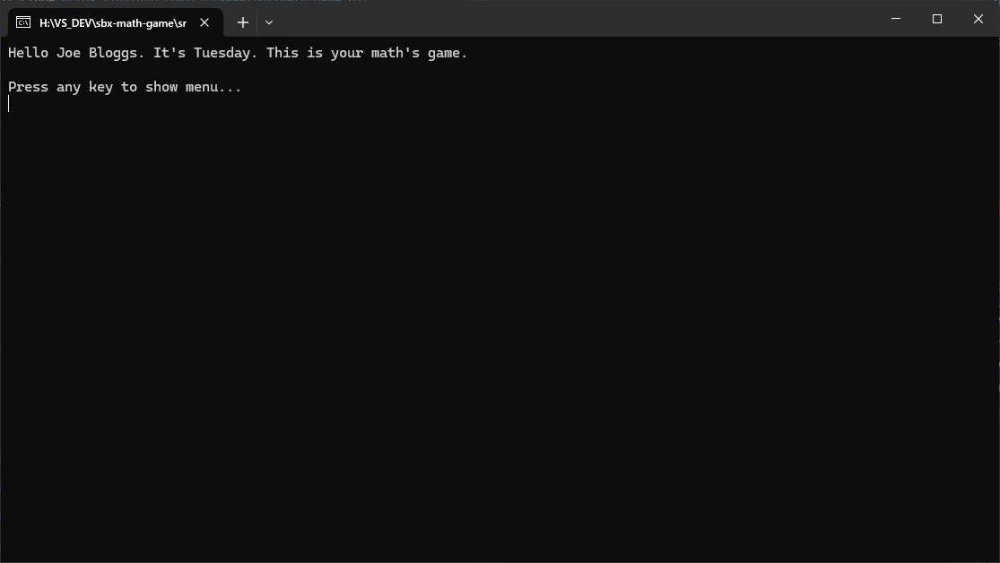
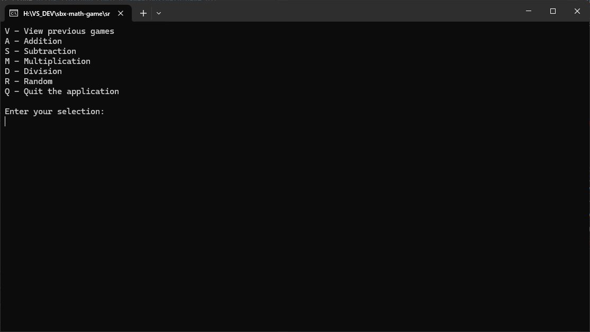
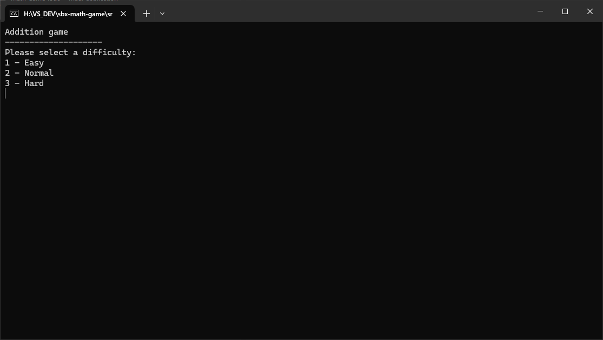
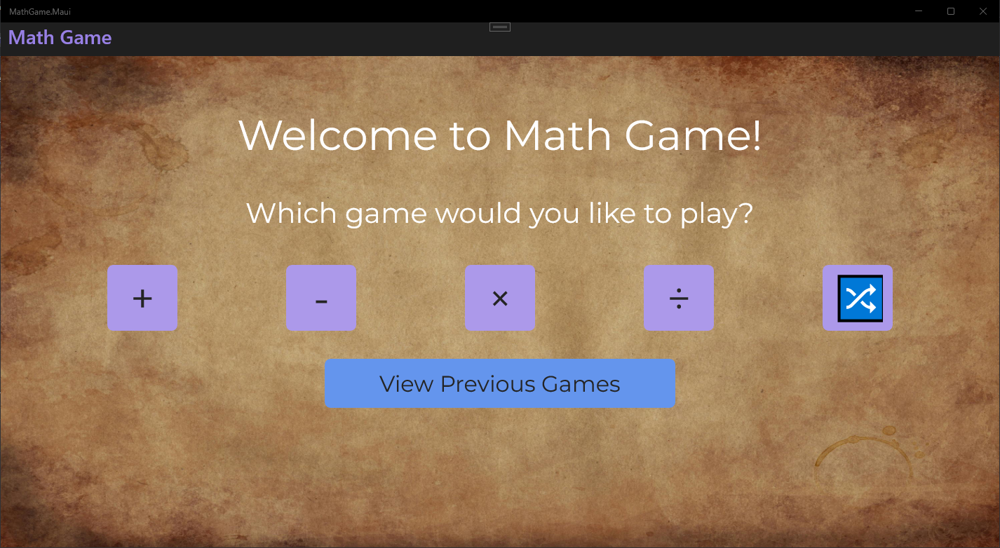
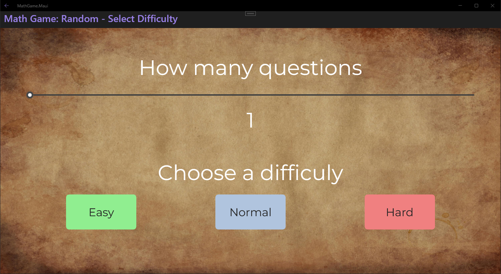

<div align="center">
   
   <h1>Math Game</h1>
</div>

Welcome to the **Math Game** App!

This is a .NET project designed to demonstrate a simple console application.

Math Game is an interactive application for young school children. It aims to challenge their math skills through various arithmetic operations. 
It can be played via Console Application, or MAUI application (Windows only).

Choose your operation, difficulty level, and number of questions to start sharpening your mind!

## Table of Contents <!-- omit in toc -->

- [Getting Started](#getting-started)
  - [Prerequisites](#prerequisites)
  - [Running the Application](#running-the-application)
  - [Docker Container](#docker-container)
    - [Building the Container](#building-the-container)
    - [Running the Container](#running-the-container)
    - [Notes](#notes)
- [Requirements](#requirements)
  - [Math Game](#math-game)
    - [Challenges](#challenges)
  - [Intro to Docker](#intro-to-docker)
    - [Challenges](#challenges-1)
- [Features](#features)
- [Technologies](#technologies)
- [Usage](#usage)
  - [Console](#console)
  - [MAUI](#maui)
- [How It Works](#how-it-works)
- [Contributing](#contributing)
- [License](#license)
- [Contact](#contact)

## Getting Started

### Prerequisites

> [!IMPORTANT]
> These are required in order for the application to run.

- .NET 8 SDK.

> [!NOTE]
> These are optional.

- An IDE (code editor) like Visual Studio 2022 or Visual Studio Code.
- Docker (for running the console application inside a container).

### Running the Application

1. Clone the repository:
    ```bash
	  git clone https://github.com/chrisjamiecarter/math-game.git
    ```

2. You can run the Console or MAUI project from Visual Studio (ensure the correct project is set as the startup project).

OR

3. Run the Console or MAUI application using the .NET CLI from the solution root directory:
    ```bash
    dotnet run --project ./src/MathGame.Console
    dotnet run --project ./src/MathGame.Maui
    ```

### Docker Container

This section explains how to run the Math Game console application inside a Docker container.

#### Building the Container

1. Build the Docker image using the docker cli from the solution root directory:
   ```bash
   docker build -t mathgame:v1.0.0 -t mathgame:latest .
   ```

#### Running the Container

1. Run the version tag specific container in interactive mode and remove it after exit:
   ```bash
   docker run -it --rm mathgame:v1.0.0
   ```

OR

2. Run the latest tag container in interactive mode and remove it after exit:
   ```bash
   docker run -it --rm mathgame:latest
   ```

3. The application will start and prompt for your name. Enter your name to begin playing!

#### Notes

- No external dependencies are required (the database is created temporarily during runtime).
- The container uses .NET 8.0 runtime.
- Data is not persisted between container runs.
- Use `-it` flag to run in interactive mode - without it, the container will appear to hang or spam errors because there's no stdin attached for user input.
- Use `--rm` flag to delete the container after exit - without it, the container will remain.

## Requirements

### Math Game

This application fulfils the following [The C# Academy - Math Game](https://thecsharpacademy.com/project/53/math-game) project requirements:

- [x] You need to create a game that consists of asking the player what's the result of a math question (i.e. 9 x 9 = ?), collecting the input and adding a point in case of a correct answer.
- [x] A game needs to have at least 5 questions.
- [x] The divisions should result on INTEGERS ONLY and dividends should go from 0 to 100. Example: Your app shouldn't present the division 7/2 to the user, since it doesn't result in an integer.
- [x] Users should be presented with a menu to choose an operation.
- [x] You should record previous games in a List and there should be an option in the menu for the user to visualize a history of previous games.
- [x] You don't need to record results on a database. Once the program is closed the results will be deleted.

#### Challenges

This application fulfils these additional challenges:

- [x] Try to implement levels of difficulty.
- [x] Add a timer to track how long the user takes to finish the game.
- [x] Create a 'Random Game' option where the players will be presented with questions from random operations
- [x] To follow the DRY Principle, try using just one method for all games. Additionally, double check your project and try to find opportunities to achieve the same functionality with less code, avoiding repetition when possible.

### Intro to Docker

This application fulfils the following [The C# Academy - Intro to Docker](https://thecsharpacademy.com/project/100002/intro-docker) project requirements:

- [x] You need to containerize a console app with Docker.
- [x] The goal is to demonstrate a working application inside a container. You do NOT need to use external databases, volumes, or advanced Docker features. The Math Game is ideal for this project, since it doesn't contain any dependencies.
- [x] You must create a Dockerfile that defines how your application is containerized. Include instructions to restore, build, and run your project.
- [x] Your Docker image should be buildable using the 'docker build' command, and the container should be runnable with 'docker run'.
- [x] You should include a brief README explaining how to build and run your container. Mention any dependencies or setup steps.

#### Challenges
- [x] Update your Dockerfile to accept command-line arguments when running the container. For example, the user could pass a difficulty level or username to the math game.
- [x] Tag your Docker image with a custom version label (e.g. 'mathgame:v1') and use that tag when running the container. This helps build awareness of image versioning and future maintainability.

## Features

- **Basic Operations**:
  - Addition, Subtraction, Multiplication, Division.
- **Integer-Only Division**:
  - All division problems ensure integer results with dividends ranging from 0 to 100.
- **User Menu**:
  - Easy-to-use menu for selecting operations, difficulty levels, and more.
- **Game History**:
  - View a history of all your previous games.
- **Difficulty Levels**:
  - Select from different levels of difficulty to match your skill.
- **Timer**: 
  - Tracks the time taken to complete each game.
- **Customizable Questions**:
  - Choose the number of questions you want to attempt.
- **Random Game**:
  - Get questions from random operations for an extra challenge.

## Technologies

- .NET 8
- Sqlite
- MAUI
- Docker

## Usage

### Console

When you start the application, you will be asked to type your name:



After which, the application will welcome you:



You will then be presented with a menu:



Choose an option:
- **V**: to view the games history page, including date, game type, score and time taken.
- **A**: to play an Addition game.
- **S**: to play a Subtraction game.
- **M**: to play a Multiplication game.
- **D**: to play a Division game.
- **R**: to play a game with a mix of questions from all operations.
- **Q**: to quit the application.

If you choose to play a game, you will then be presented with a difficulty menu:
    


Choose an option:
- **Easy**: numbers between 1-10.
- **Medium**: number between 1-100.
- **Hard**: number between 1-1000

Then, enter how many questions you want to answer and the game will then start with your your selected options.

On completion, the game will be recorded to an SQLite3 database.

### MAUI

When you start the application, you will be presented with a menu:



Choose an option:
- **+**: to play an Addition game.
- **-**: to play a Subtraction game.
- **×**: to play a Multiplication game.
- **÷**: to play a Division game.
- **🔀**: to play a game with a mix of questions from all operations.
- **View Previous Games**: to view the games history page, including date, game type, score and time taken.

If you choose to play a game, you will then be presented with a difficulty menu:
    


Use the slider to choose how many questions you want to answer.

Then choose a difficulty and the game will then start with your your selected options:
- **Easy**: numbers between 1-10.
- **Medium**: number between 1-100.
- **Hard**: number between 1-1000

On completion, the game will be recorded to an SQLite3 database.

## How It Works

- **Menu Navigation**: Navigate through the menu using the provided options to set up your game.
- **Question** Generation: Based on your selected operation and difficulty, the app generates questions.
- **Timer**: The timer starts when you begin answering and stops when you finish.
- **History Recording**: After completing a game, your score and time are recorded in the history.    

## Contributing

Contributions are welcome! Please fork the repository and create a pull request with your changes. For major changes, please open an issue first to discuss what you would like to change.

## License

This project is licensed under the MIT License. See the [LICENSE](./LICENSE) file for details.

## Contact

For any questions or feedback, please open an issue.

---

***Happy Math Gaming!***
